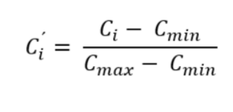
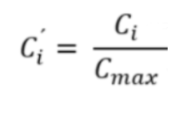
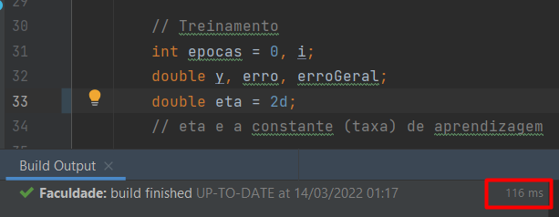
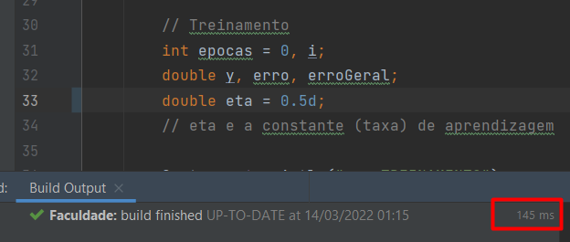
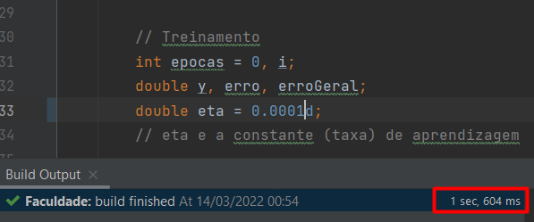
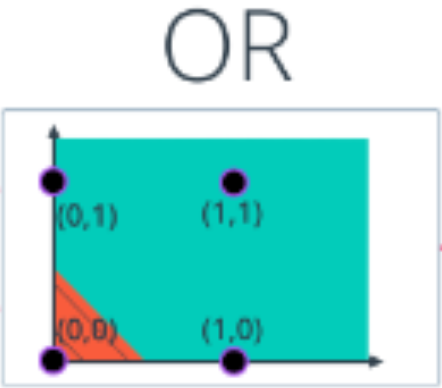
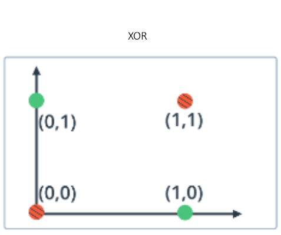

# DESENVOLVIMENTO DE SISTEMAS INTELIGENTES 

## Aula 02 - 18/03/2022
### Etapa 2 (Cliente - Renda - Divida - Classe):

### Diretórios: 
  - TDE_03_18_03_2022_1
  - TDE_03_18_03_2022_2

I – Altere o programa de tal forma que a rede consiga determinar se um cliente é um mau ou bom pagador.
Utilize os dados da tabela para treinar a rede. Execute:
- Analise quais dados são adequados para servirem de entrada para a rede (seções).
        
      Os dados adequados para servirem de entrada para rede neural são: "renda", "divida" e a classe como resultado desejado.

- Normalize as entradas, os valores devem estar entre 0 e 1. Uma forma de normalização para renda, por exemplo, é dividir todas as rendas pela maior renda encontradas na tabela. Verifique e busque uma normalização adequada para o tipo de dados (informe qual foi a escolhida).

      Realizei dois exemplos deste exercicio:
      I. Encontrado no diretório TDE_03_18_03_2022_1 utilizando a formula: 

     

      II. Encontrado no diretório TDE_03_18_03_2022_2 utilizando a sujestão do exercicio, dividindo todas as rendas pela maior renda encontradas na tabela.

      

- Codifique a classe utilizando valores numéricos. Esses valores devem corresponder aos valores do fundo de ativação, ou seja, aos valores que
ela é capaz de gerar.
- Utilize 70% dos dados da tabela para treino e o restante para teste.
- Contabilize o número de acerto e erros da rede na fase de teste.
  -  Exemplo I
     -  Epoca 1
        - Erros: 7
        - Acertos:7
     -  Epoca 2
        - Erros: 4 
        - Acertos: 10
     -  Epoca 3
        - Erros: 2
        - Acertos: 12
     -  Epoca 4
        -  Erros: 2
        -  Acertos: 12
     -  Epoca 5
        -  Erros: 2 
        -  Acertos: 12
     -  Epoca 6
        -  Erros: 0
        -  Acertos: 14
  -  Exemplo II
     -  Epoca 1
        - Erros: 7
        - Acertos:7
     -  Epoca 2
        - Erros: 4 
        - Acertos: 10
     -  Epoca 3
        - Erros: 2
        - Acertos: 12
     -  Epoca 4
        -  Erros: 2
        -  Acertos: 12
     -  Epoca 5
        -  Erros: 2 
        -  Acertos: 12
     -  Epoca 6
        -  Erros: 0
        -  Acertos: 14
  
- Envie as alterações efetuadas no exercício em um arquivo editável para o link: Exercício I, disponível no Ambiente Aula.

  - Igualdade nos dois exemplos:
      
      - Utilizaram 6 épocas para realizar o treinamento com os dados.

  - Difenciação nos dois exemplos:
      - Apresentaram resultados diferentes:
  

## Aula 01 - 11/03/2022

### Diretório: TDE_02_11_03_2022

### Etapa 1 (Entendendo a programação):
- Analise o código e entenda como cada uma das etapas de implementação são constituídas, faça um pequeno relato
  em modo texto. Podem ser inseridos códigos para auxiliar nas explicações.

#### Treinamento
* A primeira fase é o treinamento que tem como objetivo ajustar os valores dos pesos (**W**n):
  * Apresentado os dados para o treinamento.
  * É composto por um loop que se repete no tamanho do vetor **x1**;
  * Temos duas equações:
    * **Função calculaY**: 
        * Chama a função calculaV;
        * Recebe com retorno o valor do campo induzido (**y**)
        * Tem como objetivo ser a função de ativação = (que representa a saída do neurônio)
        * Neste exemplo, usamos a função **Degrau Bipolar**: 
            * Se o retorno for positvo ou nulo, retorna 1
            * Se o retorno for negativo retorna 0
  * **Função calculaV**:
    *  Calcula o valor do campo induzido:
    
  * **Calcula o erro**:
    * Compara o resultado esperado do treinamento (d[i]) - a saída do neurônio.
    * Em caso de ter retornar um valor diferente de zero é ajustado os valores dos pesos:
      * **eta** e a constante (taxa) de aprendizagem
        * Não pode ter um valor muito baixo = aprendizagem lenta
        * Não pode ter um valor muito alto = não aprende 

#### Generalização
* Recebe os novos dados digitados pelo usuário
* E apresenta o valor do campo induzido
  
### Etapa 2 (Testando a Rede):
Execute:
 * **I** - Altere a constante de aprendizado (eta) para valores como 2, 0.5 e 0.001 e verifique se com esses valores influenciam
  no número de épocas do treinamento e, nos ajustes dos pesos. Relate o que ocorreu e a teoria do porquê influenciaram
  ou não.
   
   
   " [...]  A taxa de aprendizado é um parâmetro constante no intervalo [0,1] que interfere na convergência do processo de aprendizado. 
A influência deste parâmetro está relacionada à mudança nos pesos sinápticos. Assim, uma taxa de aprendizado muito pequena 
implica numa trajetória suave e pequena mudanças nos pesos a cada iteração. No entanto, requer-se um tempo de treinamento muito
longo, e dependendo da utilização dos pesos é possível cair no problema de mínimo local, pois ANN nesse caso não consegue 
calcular uma mudança nos pesos que faça a rede sair no mínimo local. [...]"

" [..] Se a taxa de aprendizado for muito grande, (perto de 1), ocorre uma maior mudança nos pesos, aumentando a velocidade do aprendizado,
o que pode levar a oscilações em torno do mínimo global. Assim, a taxa de aprendizado não deve ser muito pequena, nem muito grande. [...]"

Fonte da Resposta: https://www.maxwell.vrac.puc-rio.br/32823/32823_4.PDF

Ao executar o programa alterando os parâmetros o tempo de execução:

* [2]

 

* [0.5]

  

* [0.001]

  

 * **II** - Altere a implementação para que reconheça a tabela OR e relate se continua funcionando ou não e, o porquê
  (respostas sem justificativas serão anuladas).

    - No caso do OR funciona pois as entradas diferentes de [0,0] retornam 1.
    - Assim é possivel separar os resultados por uma reta, conforme na imagem, separando os resultados.   
  
  
        

 * **III** - Altere a implementação para que reconheça a tabela XOR e relate se continua funcionando ou não e, o porquê
  (responsas sem justificativas serão anuladas).

   - No caso do XOR não funciona pois as entradas [0,1] e [1,0] retornam 1.
   - Não é possivel separar os resultados por uma reta.

  